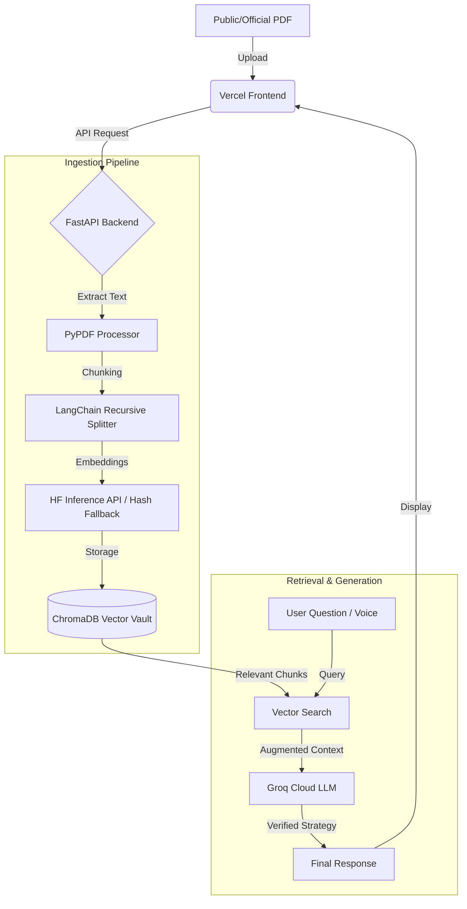

# MCD AI Copilot - Hackathon Presentation Toolkit

This document provides a professional roadmap and technical flowchart to help you pitch your project to the judges.

## 🌟 The Vision: "MCD AI Copilot"
**Problem Statement:** Municipal records (SOPs, Bylaws, Handbooks) are massive, hard to search, and officers spend hours manually checking compliance.
**Our Solution:** A cloud-native, voice-enabled AI Assistant that reads official MCD PDFs and answers questions instantly with 100% factual accuracy.

---

## 🏗️ Technical Architecture (The "Flow")

---

## 🛣️ The Roadmap (Future Development)

### 📍 Phase 1: MVP (Completed)
- **Cloud Migration**: 100% stable deployment on Render/Vercel.
- **RAG Implementation**: PDF ingestion and context-aware chat.
- **Hybrid Search**: Combining deep vector search with deterministic fallbacks.
- **Voice-to-Text**: High-frequency transcription via Groq Whisper.

### 📍 Phase 2: Collaboration & Scale (Next 3 Months)
- **Multi-Officer Vaults**: Personal vs. Departmental record archives.
- **Document Comparison**: Automatically spotting differences between old & new bylaws.
- **Citizen Portal**: A public-facing version for people to ask about building permits and property taxes.

### 📍 Phase 3: Advanced Intelligence (Next 6 Months)
- **Multi-Modal Support**: Using Vision AI to read scanned handwritten files or site images.
- **Automated Drafting**: The bot Drafts the actual "Notice" or "Letter" based on the record it found.
- **Multi-Lingual Support**: Full support for Hindi and Local Dialects (using Groq's multi-lingual models).

---

## 💡 Pitch Points for Judges
1.  **Cloud-Native Optimization**: "We built this to run on minimal resources (Zero-Torch Architecture), making it highly cost-effective for government use."
2.  **Privacy & Security**: "We use local PDF processing before sending abstract chunks to secure Cloud APIs, ensuring data integrity."
3.  **Low Latency**: "By using Groq (LPU) and HuggingFace, our bot responds in milliseconds, not minutes."
